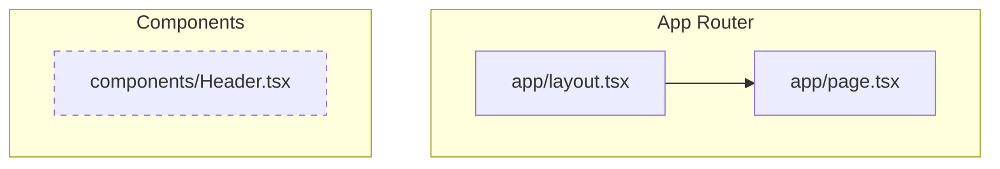

# YUV.AI Trends

## Overview
YUV.AI Trends is a Next.js application designed to track and display the latest trends in Artificial Intelligence. This project provides a platform for users to discover models, companies, and emerging technologies in the AI space.

## Project Structure

This project uses the Next.js App Router structure.

### Key Components
- **`app/layout.tsx`**: The root layout of the application.
- **`app/page.tsx`**: The main entry page.
- **`components/Header.tsx`**: The navigation header containing branding and search functionality.

## Architecture & Connections

The following Mermaid diagram illustrates the current component structure and connections within the project:



## Getting Started

### Prerequisites
- Node.js
- npm / yarn / pnpm

### Installation

1. Clone the repository:
   ```bash
   git clone https://github.com/hoodini/antig-demos.git
   ```

2. Install dependencies:
   ```bash
   npm install
   ```

3. Run the development server:
   ```bash
   npm run dev
   ```

Open [http://localhost:3000](http://localhost:3000) with your browser to see the result.
