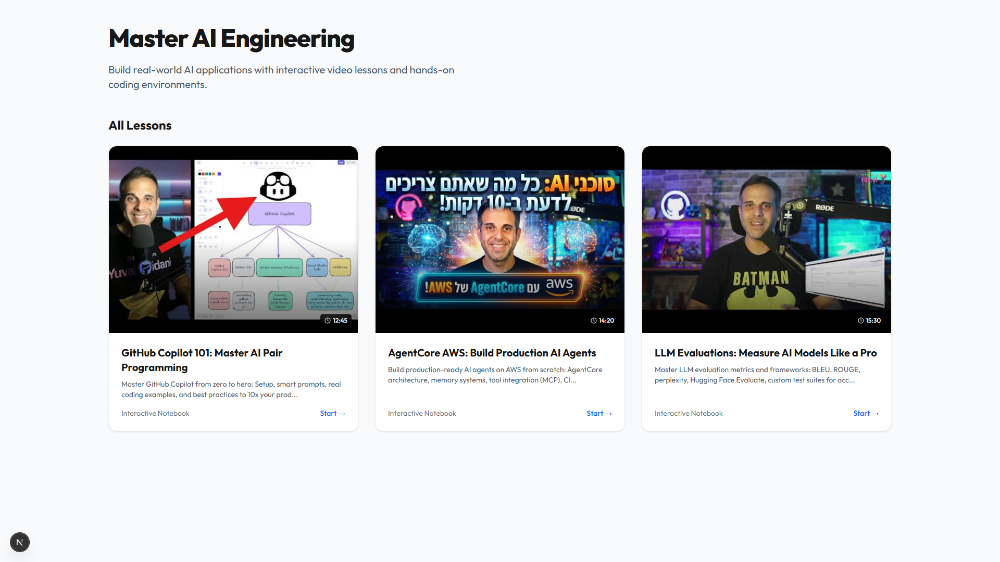

# YUV.AI Trends Dashboard

A premium, glassmorphic AI trends dashboard built for executive briefings.

## Features
- **Modern UI**: Dark mode, glassmorphism, and smooth Framer Motion animations.
- **Dynamic Filtering**: Filter trends by category (Model, Business, Research, etc.).
- **Responsive**: Fully responsive grid layout for mobile and desktop.
- **Tech Stack**: Next.js 14, Tailwind CSS, Lucide React, Framer Motion.

## Getting Started

1. Install dependencies:
   ```bash
   npm install
   ```

2. Run the development server:
   ```bash
   npm run dev
   ```

3. Open [http://localhost:3000](http://localhost:3000) with your browser to see the result.

## Screenshots

### Desktop View


### Mobile View

